## 권다솜

#### 느낀점 

## 김동완

#### 느낀점 

- api를 구축하여, 소통하는 것을 처음부터 직접 해본 것이 재밌었습니다.
- 1:N 필드와 M:N 필드를 직렬화하고 API에서 표현하는 과정에서 많은 오류를 겪고, 해결 방법을 알게되어서 좋았습니다.
- 인스턴스인지 쿼리셋인지에 따라 many=True옵션을 잘 넣어줘야한다고 생각되었습니다.
- 리뷰 POST 를 이용할 때 api를 쓰다보니 title로 데이터를 가져오거나 이런게 힘들었습니다. 내가 리뷰를 쓰는게 어디인지 헷갈리는 ?? 
- 해당 api를 프론트엔드로 넘겨서 어떻게 작업할지 좀 궁금합니다. 


## 이번 ptj를 통해 배운 내용

- DRF(Django Rest Framework)를 활용한 API Server 제작

- Database 1:N, M:N에 대한 이해

### 개발도구

- Visual Studio Code
-  Google Chrome Browser
-  Django 3.2+
- Postman

### 요구사항 

- django 프로젝트 이름은 pjt08, 앱 이름은 movies로 지정합니다.
- 모델 간의 관계 설정 후 다음과 같은 기능을 구현합니다. 
- A. Actor 
  - i. 배우 데이터 조회 
- B. Movie 
  - 영화 데이터 조회 
- C. Review 
  - 리뷰 데이터 조회 / 생성 / 수정 / 삭제 

- 데이터 조회는 JSON 데이터 타입을 따릅니다.
  아래 기술된 사항들은 필수적으로 구현해야 하는 내용입니다. 

### Model

- Actor 클래스

| 필드명 | 데이터 유형  |   역할    |
| :----: | :----------: | :-------: |
|  name  | varchar(100) | 배우 이름 |

- Movie 클래스

|    필드명    | 데이터 유형  |    역할     |
| :----------: | :----------: | :---------: |
|    title     | varchar(100) |  영화 제목  |
|   overview   |     text     |   줄거리    |
| release_date |   datetime   |   개봉일    |
| poster_path  |     text     | 포스터 주소 |

- Review

|  필드명  | 데이터 유형  |             역할             |
| :------: | :----------: | :--------------------------: |
|  title   | varchar(100) |          리뷰 제목           |
| content  |     text     |          리뷰 내용           |
| movie_id |   integer    | 외래 키 (Movie 클래스 참조 ) |

#### ERD

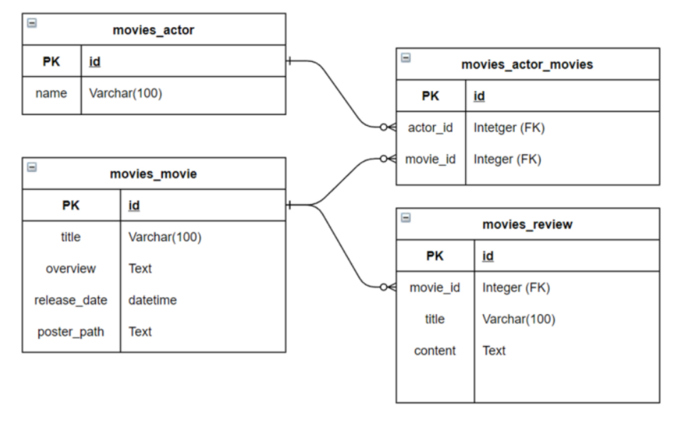

### 프로젝트 진행

##### 프로젝트는 전반적으로 기능을 구현하며 커밋을 진행했으므로, 커밋 순서에 따라서 진행을 서술하겠습니다.

다만, 협업 프로젝트를 하다보니 정신이 없어 일일히 진행과정을 캡처하지 못해, 최종 결과 캡처본을 첨부합니다.

### D: 김동완, N : 권다솜

### 1단계 : 기본 형식 만들기

#### basic setting 

- 기본적인 장고 세팅을 했습니다.
- 가상환경 설정, gitignore, 프로젝트 생성, 앱 등록, 템플릿(base.html) 만들기를 진행했습니다. 
- api를 다뤄야하고, 가상 데이터를 생성해서 확인하기 위해 django-seed, rest_framwork를 설치했습니다.

### Model 만들기

- ModelSerializer를 사용하기 위해 선제적으로 모델을 만들었습니다.
- ERD명세서에 따라 모델을 구성했으나, ERD필드와 주어진 fixtures 데이터의 형식이 달라 문제를 겪었고, 구현 과정에서 ERD가 잘못되었다는 것을 알게되었습니다.
-  M:N 필드 위치를 조정해 문제를 해결할 수 있었습니다. 

```python
from django.db import models

# Create your models here.

class Actor(models.Model) :
    #배우 이름 
    name = models.CharField(max_length=100)
    
    def __str__(self) :
        return f'배우이름 : {self.name}'

class Movie(models.Model) :
    #영화 제목 
    title = models.CharField(max_length=100)
    #줄거리 
    overview = models.TextField()
    #개봉일 
    release_date = models.DateField()
    #포스터 주소 
    poster_path = models.TextField()
    actors = models.ManyToManyField(Actor,related_name='starring_movie')

    def __str__(self) :
        return f'영화제목 : {self.title} 줄거리 : {self.overview}'


class Review(models.Model) :
    movie = models.ForeignKey(Movie,on_delete=models.CASCADE)
    title = models.CharField(max_length=100)
    content = models.TextField()
    def __str__(self) :
        return f'영화제목 : {self.title} 줄거리 : {self.content}'

```

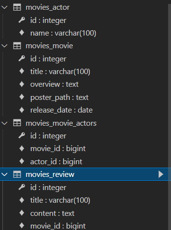

### Admin Custom

- 해당 프로젝트의 경우 API를 운영하는 것이고, 편리하게 CRUD를 하는 과정이 없기 때문에, Admin 페이지에서 데이터를 넣어줘야 했습니다.
- 따라서, Admin 페이지에 가독성 있게 데이터를 넣을 수 있도록 Admin 페이지에 List display를 지정하고, Model에는 return 형식을 변경했습니다. 

```python
from django.contrib import admin
from .models import Actor,Movie,Review
# Register your models here.

class ActorAdmin(admin.ModelAdmin) :

    model = Actor
    list_display = ('name',)


class MovieAdmin(admin.ModelAdmin) :

    model = Movie
    list_display = ('title','overview',)


class ReviewAdmin(admin.ModelAdmin) :

    model = Actor
    list_display = ('title','content')

admin.site.register(Actor,ActorAdmin)
admin.site.register(Movie,MovieAdmin)
admin.site.register(Review,ReviewAdmin)
```

- 추가적으로 gitignore를 이용해 db를 원격에서 제거했습니다.

### 2단계 : API 구축

- API 구축에 앞서 url을 분리하고, url 경로를 api/v1으로 설정해주었습니다.

### Actor_list

- serializer를 이용해 view를 작성했습니다. serializer 폴더를 생성해 내부에서 ActorlistSerializer를 만들었고, 이를 통해 db의 데이터를 직렬화 하게 했습니다. get_list_or_404를 이용해 모든 데이터를 가져오고, queryset을 가져오기 때문에, many=True 옵션을 지정했습니다. 
- 명세서에 따라 GET 요청만 허용되도록 view를 작성했습니다. 

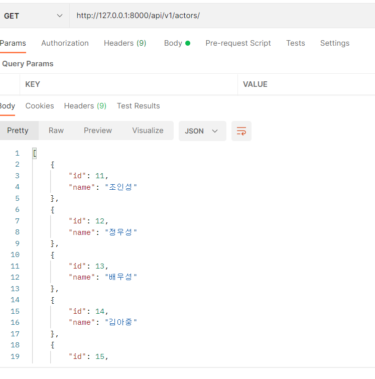

### Actor_detail

- 명세서에서 배우를 조회할 때 배우가 출연한 영화도 조회가 하도록 하는 지시가 있어, manytomany field를 이용해 직렬화 과정의 필드를 추가했습니다.
- 먼저, movieserializer 클래스를 만들고 해당 클래스를 이용 후 역참조를 통해 배우가 출현한 영화 제목을 뽑아내도록 했습니다.

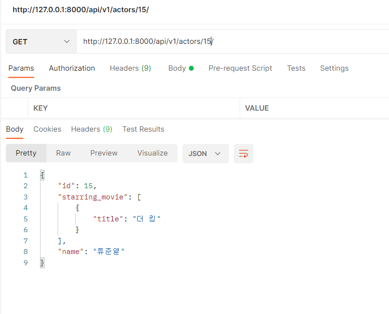


### Movie_list

- 모든 영화 리스트를 출력하게 하는 API를 구성했습니다. 모든 정보가 나올 필요 없으므로 직렬화 과정에서, title과 overview 필드만 노출되게 조정했습니다. 

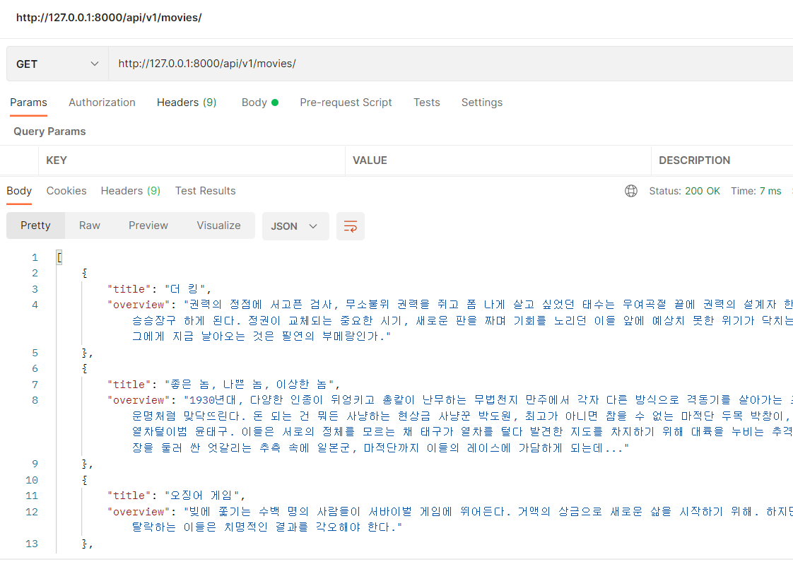


### Movie_detail

- 단일 영화의 세부 정보를 볼 수 있는 API입니다. 이 과정에서 리뷰 목록과 출연 배우의 목록도 포함시키는 것이 어려웠습니다.
- 문제를 겪은 부분은 유지보수를 위해 serializer 폴더 내부에서 각 actor,movie,review 파일을 만들고 개발을 진행했으나, 서로 다른 클래스를 참조하는 과정에서 circular import error가 발생했습니다.
- 클래스를 가져오는 과정에서 반복적인 참조가 발생해서 그런 것 같습니다.
- 따라서, 다른 클래스를 직접 import해서 가져오지 않고, 직렬화 클래스를 Movie 파일 내부에서도 dummy로 생성해서 해결했습니다. 

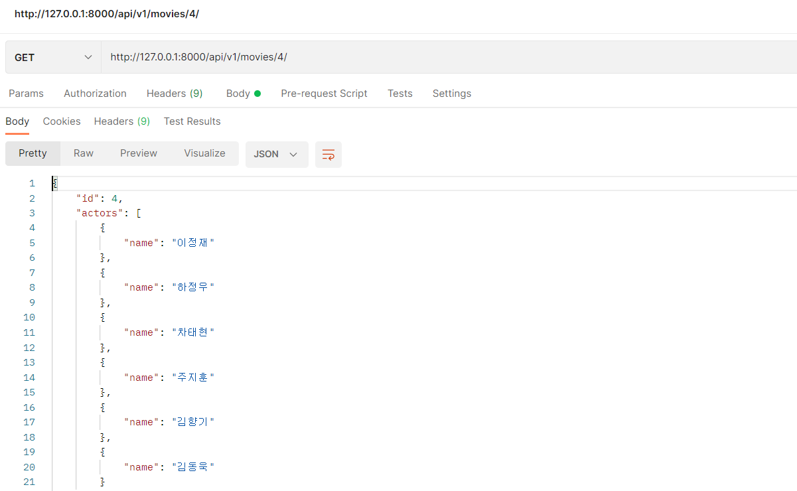

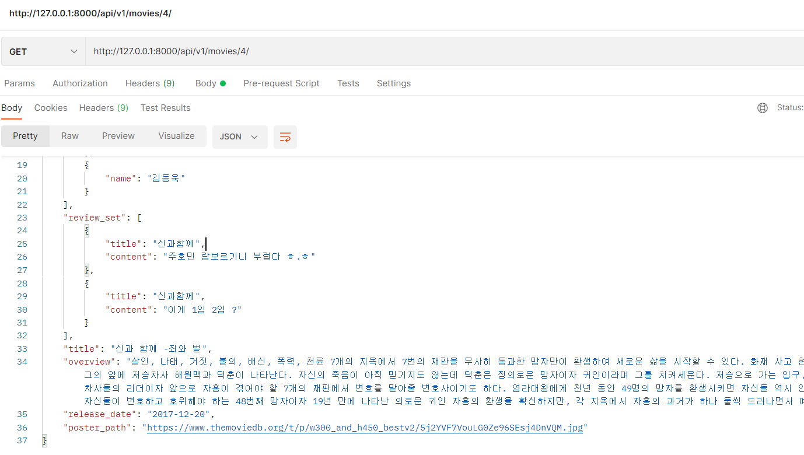

### review_list

- 리뷰의 목록을 출력할 때 작성된 영화의 정보도 포함되게 진행했습니다.

- 해당 과정에서 Movieserializer를 사용하는데, 출력이 되지 않는 문제가 발생했습니다. 

- 구글링을 통해 2가지 방법을 찾아서 해결할 수 있었습니다. 

  - 첫번째는 클래스 내부에 representation 함수를 정의 해 직접 필드를 만들어줘서 추가해주는 방법입니다.

  ```python
  class Reviewserializer(serializers.ModelSerializer) :
      def to_representation(self, instance) :
          response = super().to_representation(instance)
          response['movie'] = dummyMovieserializer(instance.movie).data 
          return response
  ```

  - 두번째는 각 영화가 인스턴스였는데, many=True를 줘서 문제가 발생했습니다.  

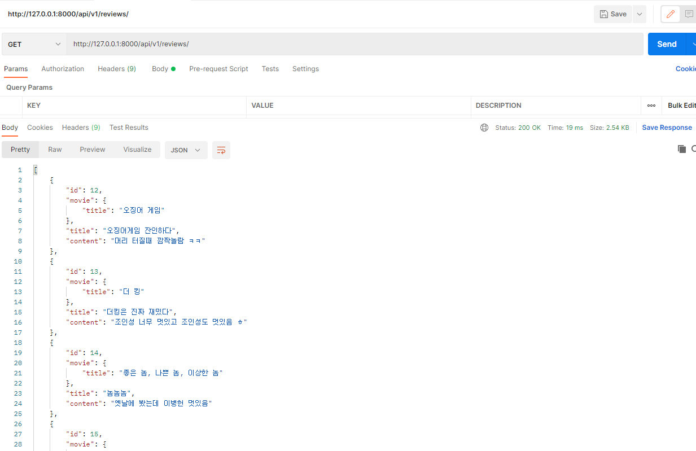


### review_detail

- 리뷰 detail을 만들 때는 리스트를 만들때와 같은 serializer를 사용했습니다.
- view함수를 Http method에 따라 분기처리하고, 각 조건에 따라 직렬화 후 반환하게 했습니다.
- create와 delete 경우에는 성공,실패 시 다른 method가 출력되게 하여 문제가 발생했을 시 원인을 찾기 보다 쉽게 구성했습니다.

#### get

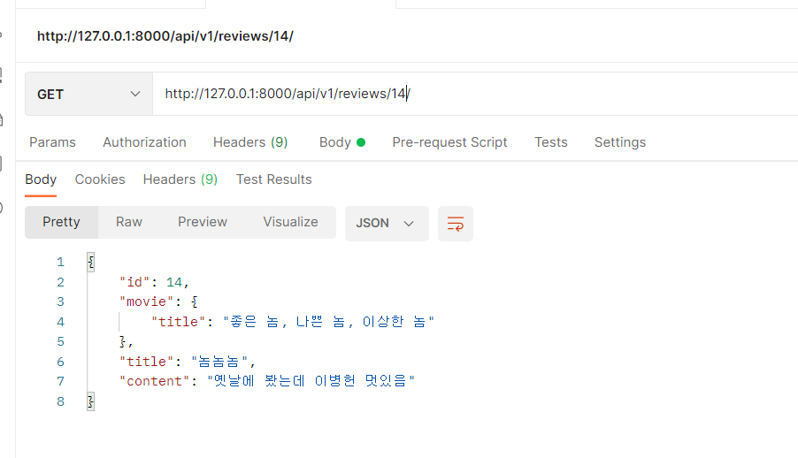

#### Put

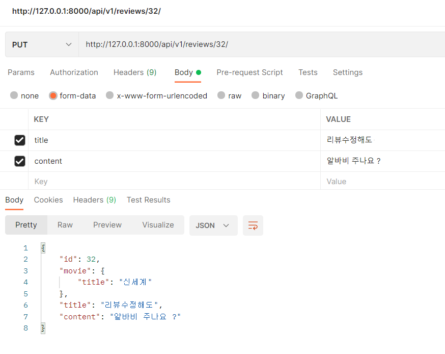

#### delete

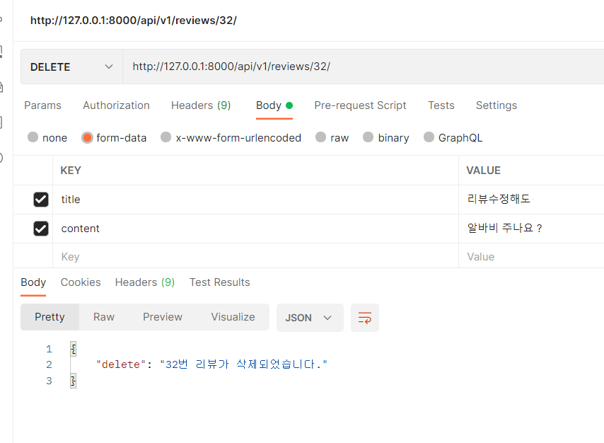

#### review_post

- 리뷰 작성을 할때는 어떤 영화에 들어갈지 먼저 알아야하기 때문에, url에서 영화의 pk를 받게 했습니다.
- 그 후 직렬화와 유효성 검사, 영화 저장 과정을 거쳐 새로운 리뷰를 저장하게 했습니다.

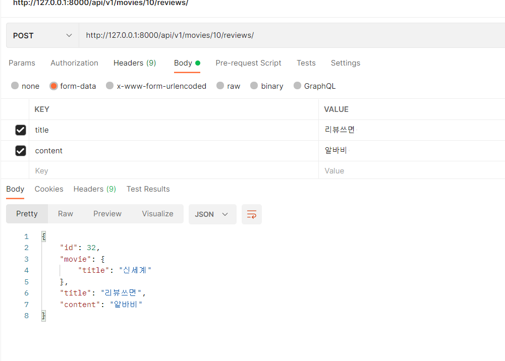

#### 데이터 저장

- admin에서 작성한 데이터를 상호 교환하기 위해 dumpdata를 만들었는데, utf-8을 인식하지 못하고 json 파일이 다깨져버리는 문제가 발생했습니다.
- 구글링을 통해 utf-8을 다시 인코딩 하는 방법과 패키지를 이용해서 다른 방식으로 dump하는 방법을 알게 되었습니다.

#### utf-8로 인코딩

```shell
python -Xutf8 manage.py dumpdata --indent 4 movies.movie > movie.json
```

#### 패키지 설치

https://github.com/panhaoyu/django-dump-load-utf8


